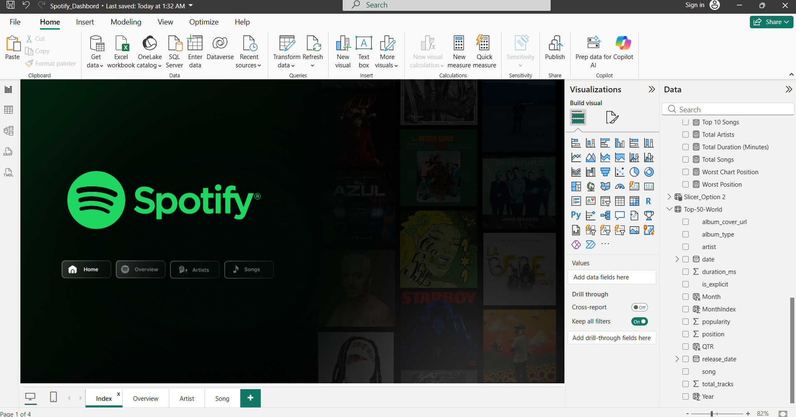
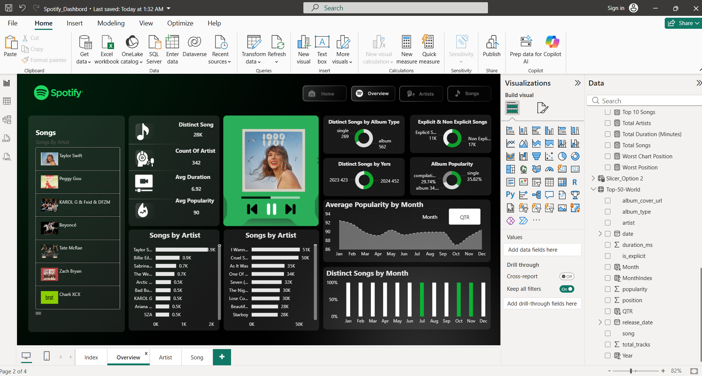
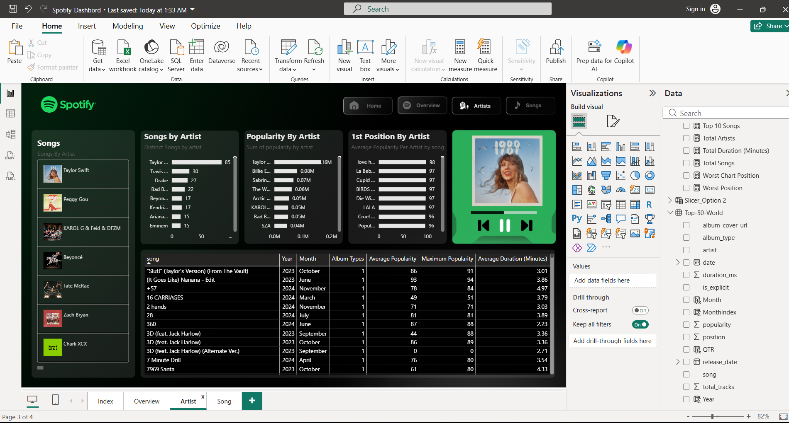
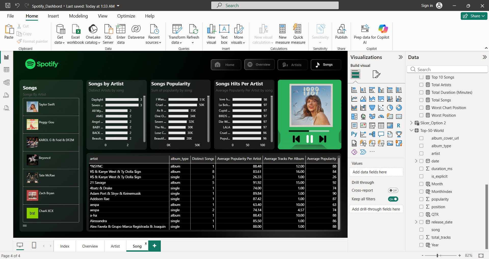

<div align="center">

# 🎵 Spotify Music Analytics Dashboard

### Transforming Spotify Music Data into Actionable Insights with Microsoft Power BI

<p align="center">


</p>

### ⭐ If you find this project useful, consider giving it a star.

</div>

---

## 📖 Table of Contents

- [Project Overview](#-project-overview)
- [Business Problem](#-business-problem)
- [Dashboard Objectives](#-dashboard-objectives)
- [Architecture](#-architecture)
- [Dashboard Preview](#-dashboard-preview)
- [Dashboard Pages](#-dashboard-pages)
- [Dataset](#-dataset)
- [Data Preparation](#-data-preparation)
- [Data Model](#-data-model)
- [DAX Measures](#-dax-measures)
- [Features](#-features)
- [Business Insights](#-business-insights)
- [Technologies Used](#-technologies-used)
- [Skills Demonstrated](#-skills-demonstrated)
- [Repository Structure](#-repository-structure)
- [Getting Started](#-getting-started)
- [Future Enhancements](#-future-enhancements)
- [Author](#-author)
- [Acknowledgements](#-acknowledgements)
- [License](#-license)

---

## 📌 Project Overview

The **Spotify Music Analytics Dashboard** is an end-to-end Business Intelligence project built in **Microsoft Power BI**, analyzing Spotify's **Top 50 – World** chart data (~27,800 daily chart entries, May 2023 – November 2024, 358+ artists).

Instead of presenting raw tables, the report converts that data into an interactive, Spotify-branded experience — with custom navigation, KPI cards, drill-down tables, and a "Now Playing" style widget — so users can explore artist performance, song popularity, album trends, and release patterns at a glance.

---

## 💼 Business Problem

Streaming platforms generate data on millions of songs from thousands of artists. Without a way to explore it interactively, it's hard to answer questions like:

- Which artists and songs dominate the charts, and how consistently?
- Do albums or singles tend to perform better?
- How is explicit content distributed across the catalog?
- How does average popularity shift month to month or quarter to quarter?
- Which artists release the most tracks, and does volume correlate with popularity?

This dashboard turns the raw chart-history CSV into a self-service analytics tool that answers these questions without writing a single query.

---

## 🎯 Dashboard Objectives

- Analyze Spotify's Top 50 – World chart performance over time
- Compare artists by song count, chart position, and average popularity
- Measure song-level popularity and duration trends
- Break down album type (single vs. album) and explicit-content distribution
- Deliver everything through a polished, brand-consistent, interactive UI

---

## 🏗 Architecture

```text
Spotify Top 50 – World Dataset (CSV)
              │
              ▼
        Power Query
 (Cleaning, Type Formatting, Calculated Columns)
              │
              ▼
        Data Model
 (Date Table, Relationships, Hierarchies)
              │
              ▼
        DAX Measures
   (KPIs, Trends, Rankings)
              │
              ▼
   Interactive Power BI Report
              │
              ▼
        Business Insights
```

---

## 🖥 Dashboard Preview

### 🏠 Home


### 📈 Overview


### 🎤 Artist Analysis


### 🎶 Song Analysis


---

## 📑 Dashboard Pages

### 🏠 Home
A clean, Spotify-branded landing page with a nav bar (Home / Overview / Artists / Songs) for moving between report sections.

### 📊 Overview
A high-level summary of the chart data:
- Distinct songs, total artists, average popularity, average duration
- Album type split (single vs. album) and explicit vs. non-explicit breakdown
- Monthly average popularity trend and distinct-songs-by-month trend
- Artist-level "songs by artist" ranking

### 🎤 Artist Analysis
Artist-level deep dive:
- Songs by artist and total popularity contributed by artist
- Best chart position achieved per artist
- Detailed, filterable song table (year, month, album type, avg./max popularity, avg. duration)

### 🎶 Song Analysis
Song-level deep dive:
- Top songs by popularity
- Distinct songs and popularity contribution by artist
- Per-artist summary table (distinct songs, avg. popularity, avg. tracks per album)

---

## 📂 Dataset

**Source:** `spotify-top-50-world.csv`

| Attribute | Value |
|---|---|
| Rows | ~27,800 daily chart entries |
| Date range | May 2023 – November 2024 |
| Unique artists | 358+ |
| Grain | One row per song, per chart position, per day |

| Column | Description |
|---|---|
| `date` | Chart date |
| `position` | Chart rank (1–50) |
| `song` | Track name |
| `artist` | Artist(s) |
| `popularity` | Spotify popularity score |
| `duration_ms` | Track duration (ms) |
| `album_type` | `album` or `single` |
| `total_tracks` | Track count on the parent album |
| `release_date` | Album/track release date |
| `is_explicit` | Explicit content flag |
| `album_cover_url` | Album artwork URL |

---

## 🧹 Data Preparation

Cleaned and transformed in **Power Query**:
- Removed unused/redundant columns
- Corrected data types (dates, numerics, booleans)
- Handled missing/blank values
- Built calculated columns: `Month`, `MonthIndex`, `QTR`, `Year`
- Standardized text fields (artist/song names) for consistent grouping

---

## 📊 Data Model

The report runs on a single fact table (`Top-50-World`) enriched with date-based calculated columns and slicer options, optimized for:
- Fast filtering across pages
- Time-based aggregation (month/quarter/year)
- Artist- and song-level rollups feeding the DAX measures below

---

## 🧮 DAX Measures

Core measures used across the report include:
- `Total Songs`, `Total Artists`, `Total Duration (Minutes)`
- Distinct song/artist counts by album type, year, and month
- Average popularity and average duration (overall, by artist, by song)
- `Worst Chart Position` / `Worst Position`
- Explicit vs. non-explicit song counts

*(Full measure definitions are viewable in the `.pbix` file under Model view → Data pane.)*

---

## 🚀 Features

- Spotify-inspired dark theme with custom icons and album-collage backgrounds
- Custom "Now Playing" album-art widget
- Consistent button-based navigation across all pages
- Dynamic KPI cards and donut/bar chart visuals
- Interactive slicers and cross-filtering between visuals
- Drill-through-ready, filterable detail tables

---

## 📈 Business Insights

The dashboard surfaces insights such as:
- Which artists appear most frequently and hold the strongest average chart positions
- How popularity trends shift across months and quarters
- The relative split between single releases and full albums on the chart
- The proportion of explicit vs. non-explicit content in the Top 50
- Which artists contribute the highest track volume vs. highest average popularity

---

## 🛠 Technologies Used

- Microsoft Power BI Desktop
- DAX
- Power Query (M)
- CSV data source
- GitHub (version control & portfolio hosting)

---

## 💡 Skills Demonstrated

**Business Intelligence** — dashboard development, KPI design, interactive reporting
**Data Analytics** — data cleaning, transformation, modeling, business analysis
**Power BI** — DAX, Power Query, slicers, custom navigation, interactive visuals
**Data Visualization** — bar charts, donut charts, tables, KPI cards, trend/area charts

---

## 📁 Repository Structure


> **Note:** GitHub can't preview `.pbix` files inline — download `Spotify_Dashboard.pbix` and open it in Power BI Desktop to explore the report interactively.

---

## ▶ Getting Started

**1. Clone the repository**
```bash
git clone https://github.com/YOUR_USERNAME/Spotify-Music-Analytics-Dashboard-PowerBI.git
```

**2. Open the dashboard**
Open `Dashboard/Spotify_Dashboard.pbix` in **Power BI Desktop** (free from Microsoft).

**3. Refresh data (if needed)**
If prompted, point the data source to `Dataset/spotify-top-50-world.csv` on your machine, then refresh.

**4. Explore**
Use the nav bar to move between Home, Overview, Artist, and Song pages.

---

## 🔮 Future Enhancements

- Live Spotify API integration for real-time chart updates
- Genre-level analysis
- Forecasting popularity trends
- Dynamic Top-N artist/song selector
- Tooltip pages with album art previews
- Mobile-optimized layout

---

## 👨‍💻 Author

<div align="center">

### Hrishikesh Kshirsagar
**Data Analyst | Business Intelligence Developer**

Bachelor of Engineering – Artificial Intelligence & Data Science

</div>

I'm a data analyst focused on turning raw datasets into decision-ready dashboards — from data cleaning and modeling to DAX and visual storytelling. This project reflects my approach to BI development: clean data pipelines, purposeful KPIs, and a UI designed to be used, not just looked at.

**Core Skills:** Power BI • DAX • Power Query (M) • SQL • Python • Excel • Data Modeling • Data Visualization • Machine Learning • Business Analysis

**Open to:** Data Analyst / BI Developer roles, freelance dashboard projects, and collaboration on analytics case studies.

<p align="center">
<a href="https://www.linkedin.com/in/https://www.linkedin.com/in/hrishikesh-kshirsagar-/"></a>
<a href="https://github.com/https://github.com/mrhrishikeshdev-sketch"></a>
<a href="mailto:mr.hrishikesh.dev@example.com"></a>
<a href="https://YOUR-PORTFOLIO-LINK"></a>
</p>

---

## 🙏 Acknowledgements

- Dataset sourced from Spotify's Top 50 – World chart history
- Icons used under respective free-use/attribution licenses (see `Assets/Icons/`)
- Built and designed independently as a personal portfolio project

---

## 📜 License

This project is licensed under the MIT License — see [`LICENSE`](LICENSE) for details.
Spotify branding, logos, and album artwork belong to their respective owners and are used here for non-commercial, illustrative purposes only.

---

<div align="center">

### ⭐ Thanks for visiting — if this project was useful or interesting, a star is appreciated!

</div>
